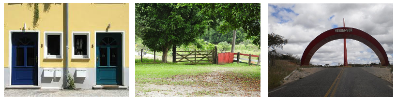
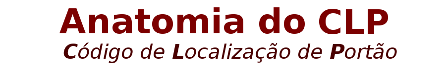

# CLP

Proposta de **C**ódigo **L**ocalizador de **P**ortão:  estudo de viabilidade.

O intuito deste projeto é apresentar recursos tecnológicos, provas de conceito e metodologias para a Comunidade OpenStreetMap e o cidadão brasileiro em geral. O foco é o "endereço de portão", ou seja, endereço para um amigo chegar até a sua casa para uma visita, [endereço para correspondência](https://schema.org/PostalAddress), endereço para entregas entre empresas ou empreendimentos em Logística, endereço de um equipamento social, etc. A referência, independente da aplicação, é esse conceito generalizado de "portão".

Existe por de trás disso o [Direito de Ir e Vir](http://www.conteudojuridico.com.br/artigo,direito-de-ir-e-vir-na-sociedade-brasileira,53479.html) (até o portão); o [Direito de Habitar](https://pt.wikipedia.org/wiki/Direito_%C3%A0_moradia), de ser dono de um portão (com pleno usufruto do mesmo); o [Direito de ser Informado](https://pt.wikipedia.org/wiki/Direito_da_informa%C3%A7%C3%A3o#Direito_%C3%A0_informa%C3%A7%C3%A3o) da localização precisa de um serviço público ou de uma sede institucional; além das questões de **custo**: buscamos exercer nossos direitos de forma o menos onerosa possível, idealmente a custo zero.

A grosso modo o **endereço de portão é um ponto geográfico**, com as suas coordenadas de latitude e longitude, e com uma certa resolução: um quadrado de **3m×3m em espaço urbano**, posicionando uma porta de casa sem confundir com o vizinho ou com o outro lado da rua; e um quadrado **15m×15m em espaço rural** (assim como também em parques e grandes propriedades), posicionando uma porteira de estratada, uma casa sem fachada, um pórtico, uma portaria, ou algo similar.

> A função do **CLP** é portanto localizar geograficamente, através de um códigio curto, um "portão genérico", de utilidade pública ou de interesse do cidadão.

## Soluções levantadas

Existem dois grupos principais de "soluções para endereçamento de portão":
* Soluções baseadas na **proximidade do portão com uma via de acesso** a ele.
* Soluções baseadas na **coordenada geográfica do portão**.

Tecnicamente uma pode ser convertida na outra através de [procedimentos de geocodificação](https://en.wikipedia.org/wiki/Geocoding#Geocoding_process).

Entre as soluções conhecidas, no presente entende-se que necessitam ser "soluções codificáveis", ou seja, que possam ser traduzidas em um *número identificador do endereço*. Esse número pode ter uma representação alternativa, não precisa ser estritamente decimal (pode usar letras como no heaxadecimal), mas precisa resultar em um código **código curto** &mdash;  sugere-se códigios de no máximo ~6 caracteres não-mnemônicos, totalizando máximo de ~12 caso  apresente também blocos mnemônicos.

Por exemplo o ponto do marco-zero de São Paulo é a coordenada `-23,5503270/-46,6339431`, que consome 23 caracteres... Para uma resolução de ~4 metros, reduziriam-se a 21 caracteres, uma cadeia ainda muito longa para se memorizar. Se a mesma coordenada for codificada em [Geohash](https://en.wikipedia.org/wiki/Geohash) como `6GYF4BF1Y`, fica reduzida a 9 caracteres. Como o prefixo `6G` de Geohash aparece em todos os pontos do município, pode-se reduzir para um mnemônico do tipo _"**Sampa-YF4.BF1Y**"_, com prefixo fácil de memorizar, e código de 7 caracteres,  palatável para a memória e comunicação entre humanos.

Quanto aos critérios de seleção, os principais são o custo e o risco de alto custo no futuro.

Se um  *sistema de localização baseada no código* não é eficiente, a sua  baixa eficiência pode ser traduzida em "alto custo para quem quer chegar no endereço". Não existem estatísticas no Brasil, mas é um custo mensurável e objetivo. Já o  critério de "risco de alto custo no futuro", se traduz na seleção de licenças abertas e identificadores transparentes:

* Algo que não faça uso de licenças abertas ([licenças _OpenDefinitoin_](https://opendefinition.org/od/2.0/pt-br/)), mesmo que não tenha custo hoje, corre sério risco de ser explorado pelo seu licenciador (proprietário) amanhã.

* Um [identificador que dependa de autoridade central](https://doi.org/10.5281/zenodo.159004) não é considerado "transparente", e o *grau de transparência* pode ser expresso pelo grau de comprometimento com uma autoridade central.  Como existem "hierarquias de identificação" (como que caixinhas uma dentro da outra), é suposto que quando mais geral (escalas de país ou Estado são mais gerais que município ou condomínio), maior a necessidade de certa centralização. Hoje identificadores tais como [ISO 3166-2:BR](https://en.wikipedia.org/wiki/ISO_3166-2:BR), dos códigos de duas letras para país (ex. AR, BO, BR) e estado (ex. AM, MG, SP), apesar de serem centralizados pela autoridade ISO, são considerados padrões abertos.

A "autoridade" do identificador, quando realmente necessária, é uma entidade sem fins lucrativos, com governança aberta e democrática... O cidadão não quer se refém de uma empresa que busca maximizar seu lucro, nem refém de troca de favores a "políticos" (risco de corrupção)  numa instituição pública fraca ou desorganizada.

### Problemas históricos considerados

Quando o endereço funciona, é "barato" para o indivíduo, não quer dizer que está sendo barato para a soma de todos os indivíduos e serviços demandados. A análise precisa levar em conta por exemplo custa para uma empresa de logística gerenciar os endereços numa base de dados sua, e quanto custo enviar para o endereço errado quando esse sistema falha.

Historicamente instituições como os Correios vem se beneficiando do [fato de ser autoridade do CEP](https://pt.stackoverflow.com/a/63936/4186) e poder cobrar direitos autoriais sobre as listas de códigos, enquanto empresas como Google se beneficiam do caos brasileiro para tornar o cidadão dependente das suas ferramentas de geocodificação.

Do ponto de vista social também são bem conhecidos os problemas, que se somam ao longo da História da Vida Privada do brasilerio, a falta de vontade politica em oferecer um endereço a quem mora em "espaços informais" (ex. favelas) e quem mora no espaço rural.

### Problemas no espaço rural

Mesmo no rico Estado de São Paulo, em pleno 2018, chegar até uma propriedade rural nunca foi simples: as vias não tem nome ou não se sabe, sinalização inexiste; distâncias são imprecisas, referências são perdidas, temporárias. Mesmo com celular, o sinal nem sempre pega.

A dor por esse abandono  é forte para o poder público e para o cidadão... É preciso unir esforços para "dar nome aos bois", identificar com precisão digital, e encontrar a agulha no palheiro.

Há anos que o governo de SP vem tentando oferecer um endereço para o ciadão do meio rural. Acreditamos que o presente estudo possa ajudar as autoridades governamentais a apreciar soluções simples, baratas e viáveis, com  comprovação de conceito realizada com o OpenStreetMap.

## Padrões analisadas

O intuito deste projeto é apresentar recursos tecnológicos, provas de conceito e metodologias. Com apoio conjunto da  comunidade de cada município e do governo, acreditamos  ser possível construir um novo protocolo de localização geográfica e de endereçamento. O padrão seria adotado inicialmente por viaturas oficiais da prefeitura, do Estado, para ocorrências policiais, ambulâncias e bombeiros. Consiste em usar métodos simples e tecnologicamente já bem conhecidos... O desafio  se resume a avaliar e adotar padrões.

### Padrões baseados na coordenada geográfica do portão
Conforme comentado acima, os principais padrões envolvidos na escrita de uma coordenada geográfica duradoura e amplamente reconhecida são:

* [ISO 6709](https://en.wikipedia.org/wiki/ISO_6709): as características gerais (inicia por latitude, usa sinal, representa graus, etc.) são estáveis desde 1983, e sua última versão é de 2009.

* [WGS84](https://en.wikipedia.org/wiki/World_Geodetic_System): sistema de referência adotado nos mapas digitais universalmente. Estável desde 1984, com revisão em 2004 e ajustes futuros não afetando a resolução nominal para a localização de um portão (3 metros).

### Padrões baseados no endereçamento postal tradicional

O principal padrão para se expressar endereços em conformidade com as tradições nacional e internacional, é  [endereço postal](https://schema.org/PostalAddress). Seus principais componentes são o nome identificador do logradouro, que é a via de acesso ao portão, e a [numeração predial](https://en.wikipedia.org/wiki/House_numbering), que é a "metragem" da posição do portão na via. Esses dois componentes, para que possam ser codificados de forma compacta, persistente e confiável precisam satisfazer padrões:

* A  via é "batizada" pelo **identificador oficial da via**. Por exemplo [`BR-116`](https://pt.wikipedia.org/wiki/BR-116) é o código de uma via federal primária,  `PIR-033/260` é o código de uma  via municipal terciária. Conforme a escala ou área em que se insere a via, fica estabelecida uma autoridade para a sua manutenção e seu batismo. "Autoridades de batismo" podem ser grosseiramente classificadas por: pública (federal, estadual, municipal), privada (interior de condomínios,  fazendas, etc.) e "natural" (riachos e trilhas naturais de menor uso).

* A numeração predial depende de estarem oficialmente fixados o **"marco zero" da via**, de onde se começa a contar a "metragem" da via; e depende também de como foi digitalizado o seu percurso (se mais retilínio a numeração diminui se mais rugoso a numeração aumenta), portanto do registro em meio digital do **"traçado oficial" da via**. Alternativamente traçados satisfatórios (aceitos como "próximos do oficial") podem ter sua métrica ajustada por algumas **amostras de "numeração predia oficial"** ao longo da via.

## Soluções analisadas e revisadas

A seguir um breve resumo das especificações detalhadas de cada uma das soluções:
* [CLP baseado em coordenadas](spec-CLP-coord.md)
* [CLP baseado em via](spec-CLP-via.md)

Resumindo a **solução baseada em coordenada**: o principal recurso padronizado para se expressar as coordenadas de latitude e longitude de um ponto através de um só número é o padrão Geohash. O que propomos é uma variante do Geohash, que, com o  acréscimo de convenções abertas (derivadas da ISO 3166-2:BR) para referenciar municípios, consegue uma pequena otimização, oferecendo códigos mais curtos e mnemônicos.

  PS: existem variantes ainda mais compactas do Geohash,  mas elas só serão exploradas como solução se houver confirmação de que o público "sente que o código Geohash é muito grande".

Resumindo a **solução baseada em endereço**: um CLP-rural baseado em endereço, por código identificador de via, requer padronização e estabilidade dos códigos de via por parte das "autoridades de batismo", entre elas o governo do estado e os municípios. Já o CLP-urbano baseado em endereços pode fazer uso do "menor CEP da via" como código oficial da via, aproveitando o fato de que a tradução de fragmentos de CEP através do [CRP](https://github.com/OSMBrasil/CRP) não oferece barreiras de direitos autoriais. Todavia bem todo município tem CEP-por-lograsouro, de modo que tais municípios, no seu espaço urbano demandariam mesma solução (e portanto enfrentariam mesmos problemas de identificação de via) que a no espaço rural.

------

&#160;&#160;Conteúdos e dados deste projeto são dedicados ao domínio público. Ver também [Créditos das imagens](assets/README.md#Imagens).    &#160;&#160;
