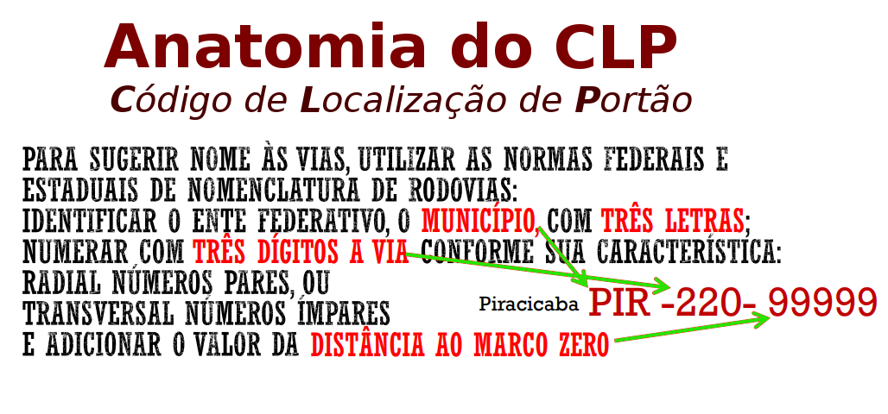
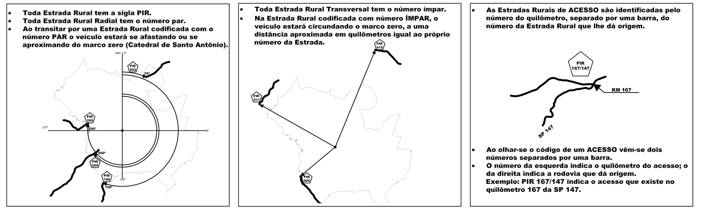

# CLP

Proposta de **C**ódigo **L**ocalizador de **P**ortão para o meio rural.

O intuito deste projeto é apresentar recursos tecnológicos, provas de conceito e metodologias para o governo do Estado de São Paulo. Há anos que o governo de SP vem tentando oferecer um endereço para o ciadão do meio rural. Com apoio conjunto da  comunidade de cada município e do governo, acreditamos  ser possível construir um novo protocolo de localização geográfica e de endereçamento. O padrão seria adotado inicialmente por viaturas oficiais da prefeitura, do Estado, para ocorrências policiais, ambulâncias e bombeiros. Consiste em usar métodos simples e já bem conhecidos, tudo é uma questão de se adotar padrões:

* Usar métodos conhecidos de localização;
* Conhecer a malha viária (com o Openstreetmap) e identificá-la;
* Comunicar os maiores interessados &mdash; os produtores rurais e demais habitantes da região;
* Divulgar e revisar os mapas básicos, batizando vias com códigos oficiais quando preciso;
* Fazer ajustes finos nas informações oficiais, e tornando-as bancos de dados públicos.

 <small>Fonte: adaptado de slides gov. SP.</small>

Exemplos de Código de Localização de Portão no meio rural:

* Uma estrada municipal com identificador oficial já destacado pelo OpenStreetMap: [PIR-033/260](https://www.openstreetmap.org/way/485934035#map=14/-22.8511/-47.9207). A numeração CLP será provavelmente a mesma porém sem separadores, **`PIR-033260`**. Ver [ipplap2017].

* Uma fazenda com porteira próxima à estrada: [ponto no Openstreetmap](https://www.openstreetmap.org/node/5679199345#map=15/-22.8603/-47.9208).  Não precisa ser exato, vale a projeção do ponto sobre a linha da estrada. Se a porteira da fazenda estivesse a 12,3 km do marco-zero da estrada, o  endereço oficial seria  **`PIR-033260-12300`**.

NOTA:  o nome "CLP" ainda não é oficial, é um apelido prelinar para servir de referência nas dicussões OSM.

## Motivações

Mesmo no rico Estado de São Paulo, em pleno 2018, chegar até uma propriedade rural nunca foi simples: as vias não tem nome ou não se sabe, sinalização inexiste; distâncias são imprecisas, referências são perdidas, temporárias. Mesmo com celular, o sinal nem sempre pega.

A dor por esse abandono  é forte para o poder público e para o cidadão... É preciso unir esforços para "dar nome aos bois", identificar com precisão digital, e encontrar a agulha no palheiro.

### Soluções preliminares

O cidadão do meio rural não ficou de braços cruzados, algumas iniciativas se concretizaram e demonstraram que há uma imensa demanda:

*  [GPS Caipira](https://www.revide.com.br/noticias/tecnologia/gps-caipira-surge-como-solucao-para-localizacao-e-seguranca-na-zona-rural/), em uso por prefeituras, polícia, SUS e hospitais de pequenas cidades de SP. Confira nos vídeos: [MP4 - vídeo](https://t.me/OSMBrasil_Comunidade/34694), [MP4 - vídeo](https://t.me/OSMBrasil_Comunidade/34695).  A ampliação da iniciativa esbarra nos protocolos de comunicação adotados, que não são totalmente abertos.

* [CEP Rural](https://www.orolo.com.br/botucatu-sp/cep-rural-chega-a-1-200-propriedades-rurais-de-botucatu/): algumas cidades como Botucatu, implementaram o "Programa Acessibilidade Rural".

A principal crítica a essas iniciativas é a [demanda por uma autoridade central](https://doi.org/10.5281/zenodo.159004) e o envolvimento de entidades privadas no controle do sistema. Estas soluções não seriam perdidas e teriam na transição para o CLP a garantia de uniformização com o restante do Estado de SP.

## Implementação

Implementar um "conversor de CLP em ponto no mapa" é relativamente simples com as tecnologias disponíveis em domínio público. Um sistema completo,  todavia, que garanta a utilização em todas as cidades, por longo prazo, e operando com todos os tipos de localidade rural, requer diversos cuidados. Preservação digital, abertura de dados, consistência das normas, consistência e viabilidade de tradução das normas para algoritmos (software) eficientes, e outros.

### Elementos metodológicos e jurídicos

O nome ou número oficial identificador do município, normatizados pelo IBGE, se apresentam como padrão oficial estável e amplamente utilizado.  Já a  codificação de abreviação de nome de cidade por código de 3 letras, ainda pouco conhecida mesmo entre as autoridades governamentais, será tão estável quanto o grau de obrigatoriedade do seu uso: uma vez publicada como tabela de-para oficial em lei ou decreto estadual &mdash; tabela anexa "de abreviação para identificador IBGE" &mdash;, não correrá mais risco de instabilidade.

Analogamente o  número oficial identificador da via, o seu marco zero e a referência oficial de mapeamento e metragem da via: sem estabilidade nestas referências oficiais não haverá incentivo ou motivação racional para o uso do CLP. Por exemplo o proprietário não vai investir em uma placa na sua porteira, a prefeitura não vai investir na divulgação de endereços, o corpo de bombeiros e hospitais não vão investir nos aplicativos de georeferenciamento dos endereços, etc.

Mas não é tão simples quanto a tabela de abreviações:

* O processo de "batismo oficial" das vias com respectivos identificadores precisa ser norteado por regras, ser transparente e descentralizado. Hoje apenas autoridades federais e estaduais possuem essa clareza de regras e acesso a meios técnicos. A descentralização inclui liberdade de usar ferramentas como o OpenStreetMap para que os municípios tenham autonomia. O mesmo vale para  

* Vias dentro de grandes propriedades (e no meio rural isso pode incluir condomínios e loteamentos) possuem como "autoridade de batismo" o proprietário ou associações de proprietários. Esse tipo de identificador deve também ser contemplado pelo processo de normatização, para garantir ampla aderência à malha viária real,  onde nasce a demanda por endereçamento. Mesmo  sendo normatizados num momento posterior, as normas de rotulação devem prever desde o início a existência dessas vias, garantindo "reserva de numeração" para elas.

* O processo de "mapeamento digital oficial" precisa prever a existência de [metodologias](https://wiki.openstreetmap.org/wiki/WikiProject_Brazil/Modelos_de_Contrato) baseadas no uso de ferramentas abertas ([licenças OpenDefinitoin](https://opendefinition.org/od/2.0/pt-br/)), tais como as ferramentas de mapeamento digital do OpenStreetMap e cadastramento de dados estruturados na Wikidata.

* As licenças de dados, tanto dados cadastrais como mapas digitais, precisa ser idealmente [CC0](http://creativecommons.org/publicdomain/zero/1.0/legalcode), ou seja, o dado precisa estar dedicado ao domínio público, sem qualquer tipo de retrição &mdash; tal como um mapa anexado à Lei Orgânica do  município. Quando isso não for possível o máximo de restrição que se pode admitir é a Licença de Banco de Dados Aberto Open Data Commons, [ODbL](http://opendatacommons.org/licenses/odbl/1.0).  Eventualmente estratégias de [liceamento dual](https://en.wikipedia.org/wiki/Multi-licensing) para dados esopecíficos podem também ajudar o município a contornar problemas jurídicos.

* Batismo informal compatível com o batismo oficial: quando da indisponibilidade de código oficial de uma via, as "regras de batismo" devem ser suficientemente claras e independentes da autoridade central para que possa ser fixada pela prefeitura ou comunidade de interesse no Openstreetmap sem maiores riscos de mudança no momento futuro da oficialização. As "normas de batismo de via" devem prever esse tipo de situação.  

* Referência em mapas oficiais quando possível (por exemplo mapas de municípios fornecidos pelo IBGE), convencionando como segunda opção, quando da indisponibilidade de mapas oficiais adequados, uma versão estável homologada do Openstreetmap. Regras objetivas e transparentes permitiram que a referência métrica não seja colocada em risco quando da ausência de um  mapa oficial.

### Subsídios técnicos

Dados abertos, estáveis e confiáveis são o lastro do CLP. Esses dados são obtidos de projetos mais especializados:

* [Identificadores persistentes](https://wiki.openstreetmap.org/wiki/Permanent_ID) no Openstreetmap, baseados na [tag Wikidata](https://wiki.openstreetmap.org/wiki/Key:wikidata), atribuida a estados, cidades e vias.   O projeto de preservação digital,  [semantic-bridge](https://github.com/OSMBrasil/semantic-bridge) ajuda a garantir a "eternidade" dos identificadores e da sua resolução no Openstreetmap. Nada será perdido, e poderemos dar garantia de décadas!

* Abreviações de nome de estado (2 letras) e **nome de cidade (3 letras)**, com respectivos **mapas digitais estáveis**, também garantidos por projetos de preservação:  [semantic-bridge](https://github.com/OSMBrasil/semantic-bridge), [datasets-br/state-codes](https://Datasets.OK.org.BR/state-codes) e [datasets-br/city-codes](https://Datasets.OK.org.BR/city-codes).

Em seguida a implementação deve contar com dois recursos fundamentais de referência de dados e padronização nos protocolos e algoritmos:

1. Preservação digital unificada de identificadores e metadados de apoio à identificação: **Wikidata**. Todas as entidades geográficas envolvidas na representação CLP são passíveis de identificação persistente e georreferenciamento a partir da [`key:wikidata`](https://wiki.openstreetmap.org/wiki/Key:wikidata) no Openstreetmap e sua identificação recíproca através da [propriedade `P402`](https://www.wikidata.org/wiki/Property:P402) Wikidata.

2. Algoritmos [PostGIS](https://postgis.net/docs/manual-2.0/) para a inferência métrica  e controle de qualidade baseado.

3. Algoritmos SparQL e SQL para consolidação dos dados junto à Wikidata. Por exemplo o conceito de "Estado de São Paulo" na Wikidata é  [Q175](http://wikidata.org/entity/Q175), o conceito de Piracicaba é  [Q330175](http://wikidata.org/entity/Q330175), de "Rodovia BR-116" é [Q2739838](http://wikidata.org/entity/Q2739838)... Todos com respectivos dados de localização no Openstreetmap ([P402](http://wikidata.org/entity/P402)).

<!--
## Exemplos e provas de conceito

SP https://www.wikidata.org/wiki/Q175

Piracicaba https://www.wikidata.org/wiki/Q330175
-->

### Subsídios sociais
O primeiro passo para se ter e discutir a qualidade das informações é a liberação em domínio público, com a publicação sob licença aberta, por parte do governo local (SP, DER ou município), das planilhas e mapas digitais. Conforme o dado ele será então consolidado e tornado mais acessível através das plataformas Wikidata e Openstreetmap. A comunidade dessas plataformas é a maior do mundo, com milhões de usuários, e tem centenas de cidadãos brasileiros participando.

Já existem inclusive prefeituras, tais como Monteiro Lobato e Jaraguá do Sul, que fazendo uso integral do Openstreetmap, como base de dados oficial do município. A utilização conjunta por parte da sociedade e do governo é viável e tem sido adotada como principal meta: enquanto dados da escala federal e estadual são mantidos por agentes do governo tais como IBGE (federal) e Secretarias (estadual), os municípios através das suas secretarias locais e os condomínios, associações, cooperativas complementam e auditam os dados mais locais.

No Openstreetmap já existe um grande percentual da malha viária do estado de SP, mas muitas vias ainda carecem de um identificador oficial. O maior trabalho, tanto em termos de auditoria como de cadastro e consolidalção de dados, será em torno da complementação dos identificadores, seguindo o modelo já de sucesso para a auditoria e preservação digitais com os repositórios  [datasets.ok.org.br/state-codes](http://datasets.ok.org.br/state-codes) e [datasets.ok.org.br/city-codes](http://datasets.ok.org.br/city-codes).

## Referências

* mapa [ipplap2017](http://www.ipplap.com.br/docs/MAPA%20DE%20ESTRADAS%20RURAIS%20ATUALIZACAO%20SET%202017%20%20-%20VERSO.pdf)

