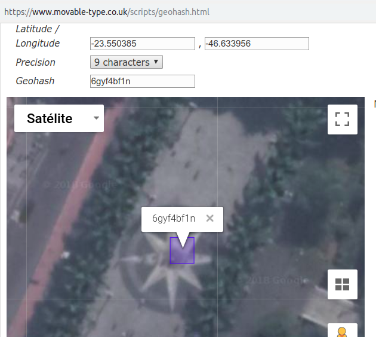
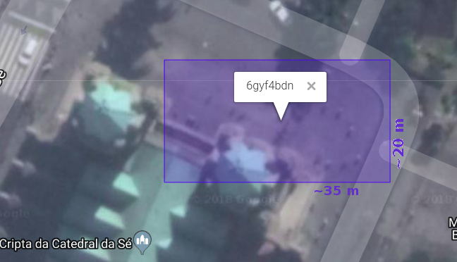
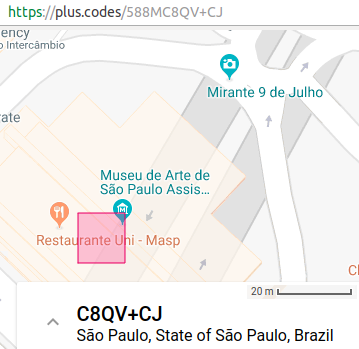
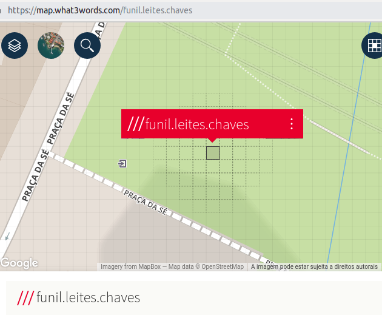
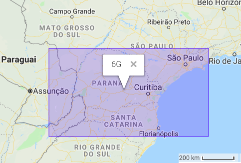
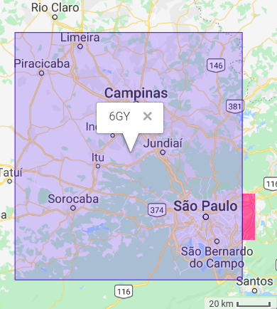
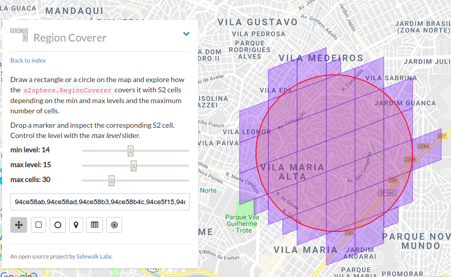

## Comparação
Comparação entre padrões mais populares: Geohash, PlusCode, MapCode. Foi acescentado ainda o padrão S2, que apesar de não ser ainda muito divulgado, é um dos recomendados.

A comparação se deu em torno de um ponto de controle bem conhecido, na capital de SP.

## Códigos do Marco-Zero de SP

[Marco Zero](https://pt.wikipedia.org/wiki/Marco_zero_da_cidade_de_S%C3%A3o_Paulo) (*latitude -23.550385, longitude -46.633956*) com ~5m de precisão nos padrões mais populares de 2018 e com infraestrutura em operação:

* Geohash (base32): `6gyf4bf1n`
* PlusCode normal (base20): `588MC9X8+RC`
* PlusCode hibrido (cidade+base20): `C9X8+RC São Paulo`
* MapCode (híbrido): `SP-RR.56`
* S2 (hexadecimal): `94ce59aaf89`

Destes, Geohash e S2 ainda não oferecem infraestrutura para sua versão híbrida, e o PlusCode ainda não oferece resolução de abreviações. Resultariam nos seguintes códigos:

* Geohash Hibrido: `SPA-YF4B.F1N`
* PlusCode com sigla da cidade: `SPA-C9X8+RC`
* S2 em base36: `3MHP9.IW09`
* S2 em base 36 com prefixo SPA: `SPA-XIW.09`

A seguir cada um dos exemplos ilustrado pelo mapa fornecido na respectiva infraestrutura pública.

### [**Geohash**](http://geohash.org/6gyf4bf1n)
O link acima envia aponta para `geohash.org` que não dá zoom compativel com a resolução do Geohash. Para a ilustração abaixo foi utilizada a interface manual de [movable-type.co.uk/scripts/geohash](https://movable-type.co.uk/scripts/geohash.html).

Os dois primeiros dígitos podem ser cortados quando sabemos que o contexto é a cidade de São Paulo (prefixo `6g`).

Porta principal (~10m), escadaria da igreja da Sé
* Geohash (base32), 9 dígitos: `6gyf4bdn9` precisão ~5x5m
* Geohash (base32), 8 dígitos: `6gyf4bdn` precisão ~35x20m

### [**PlusCode**](https://plus.codes/588MC9X8+RC)

### [**MapCode**](http://www.mapcode.com/getcoords.html?iso3=331&mapcode=RR.56&xx=-46.633956&yy=-23.550385)

### [**S2**](https://s2.sidewalklabs.com/regioncoverer/?cells=94ce59aaf89f&center=-23.550385%2C-46.633956&zoom=20)

### [**Whats3words**](https://map.what3words.com/funil.leites.chaves)

Por ser patenteado está sendo utilizado apenas como exemplo ilustrativo.

## Outros pontos de controle

Exemplificando apenas com Geohash: ...

## Exemplos de Geohash de prefixo do município
Conforme o padrão que vier a ser eleito (entre as opções Geohash, PlusCode, S2, etc.), a geometria e tamanho da menor célula a conter o muncípio será diferente. A tabela abaixo exemplifica casos de diversos municípios, mostrando junto o Geohash do seu centroide e em modo absoluto e modo relativa ao prefixo.

Município (UF-abbrev3)               | Código CLP (~4m)    | Geohash municipal | ponto (~0.5m)| Área munic. (km2)
--------------------------------|---------------|-----------------------|------|----------------
Amaraji (PE-ARJ)                | **ARJ-WB3.J236**   | 7N   | 7NWB3J23621T | ~200
Barbacena (MG-BCA)                | **BCA-0Z4.GXCV**   | 7H   | 7H0Z4GXCV8BK | ~800
Barra do Chapéu (SP-BCH)          | **BCH-THG.NK1N**   | 6G   | 6GTHGNK1NY93 | ~400
Bom Jesus da Penha (MG-BSN)       | **BSN-KZB.37**     | 6UQB | 6UQBKZB377KE | ~200
Campinas (SP-CAM) | **CAM-TDX.YF6** | 6GY  | 6GYTDXYF6FSH | ~800
Descalvado (SP-DCV)               | **DCV-5E8.X5H**    | 6UN  | 6UN5E8X5H0B2 | ~800
Dois Córregos (SP-DCR)          | **DCR-UJ8.S4J0E**  | 6    | 6UJ8S4J0ENBY | ~600
Holambra (SP-HOL)               | **HOL-X30.JHZ**   | 6GY  | 6GYX30JHZ7C3 | ~100
Jaci (SP-JCI)                     | **JCI-8ZE.FZD**    | 6UK  | 6UK8ZEFZDM0C | ~100
Jardim Alegre (PR-JDG)            | **JDG-NM9.1C5**    | 6GE  | 6GENM91C5P7W | ~400
Lagoa Real (BA-LRL)             | **LRL-9BP.JC74**   | 7J   | 7J9BPJC74SEC | ~900
Lutécia (SP-LTC)                    | **LTC-1J2.4UJ**   | 6UH  | 6UH1J24UJJYQ | ~500
Oliveira (MG-OLV)               | **OLV-1YV.9JR**    | 7H2  | 7H21YV9JREW6 | ~900
Santa Mariana (PR-SNM)          | **SNM-UHF.4YSN**  | 6G   | 6GUHF4YSNY2X | ~400
São Borja (RS-SJA)                | **SJA-FBK.9M4ME**  | 6    | 6FBK9M4MEGPF | ~3600
São Paulo (SP-SPA) | **SPA-YC2.BYHD** | 6G   | 6GYC2BYHDXTF | ~1500
São Paulo de Olivença (AM-SDO)    | **SDO-RNT.1BMP0**  | 6    | 6RNT1BMP0GX0 | ~19700
Schroeder (SC-SCH)              | **SCH-453.MSP**    | 6GM  | 6GM453MSPZR7 | ~200
Três Barras (SC-TSB)              | **TSB-70E.VP9**    | 6GK  | 6GK70EVP9S0P | ~400
Ubaitaba (BA-UIA)                 | **UIA-7YY.ETNV**   | 7J   | 7J7YYETNVBMH | ~200

Reparamos que municípios de área maior (ex. São Borja e São Paulo de Olivença) e municípios que "dão azar" de ficar entre células do Geohash, como Dois Córregos, tendem a ficar contidos em uma célula muito grande do Geohash, ou seja, ficam com o prefixo de um só dígito.

Além destes casos extremos, percebemos que daria para otimizar, economizando pelo menos um dígito. A seguir examinaremos as estratégias de otimização, que consistem em "escolher a dedo" um conjunto de células que cubra mais precisamente o território do município. No caso de São Paulo, percebe-se que o Geohash `6G` tem uma cobertura muito ampla, acaba sendo usado por diversos outros municípios:

Se para São Paulo o seguinte, `6GY`, fica de fora a pequena fração em vermelho.

<!--
SELECT nome, '**'||abbrev3||'-'||code_format(code_cut_prefix(pref,pt,9)) ||'**' as x
      , pref, pt, area
FROM (
   SELECT
     abbrev3,name||' ('||state||'-'||abbrev3||')' as nome,
     '~'||(round(km2/100)*100) area, UPPER(geohash_envelop) pref,
      upper(geohash_center) pt
    FROM test_city where abbrev3>'' and random() < 0.006
) t;
-->

## Exemplos de otimização com o prefixo da cidade

Mesmo o PlusCode que já nasceu especializado em usar nomes de cidade amigáveis no lugar estranhos prefixos,  não foi otimizado para cada cidade do mundo, é apenas um "quebra galho", ao contrário do que foi feito no MapCode (infelizmente patenteado), que consegue uma compactação muito maior por ter sido otimizado. **Cabe ao brasileiro** (governo do Brasil e/ou comunidades brasileiras organizadas, como a Comunidade OSM Brasil) **propor um esquema consistente de otimização**.

Suponhamos que a decisão final seja por códigos [base32](https://en.wikipedia.org/wiki/Base32), ou seja, com dígitos "0,1,2...,9,A,B,C...T".  Suponhamos também que o  **código completo** no padrão eleito respeite a seguinte sintaxe de concatenação, &nbsp; &nbsp; `<estado> "-" <município> "-" <codigo_celula> <codigo_sufixo>` onde cada elemento entre `<` e `>` tem o seguinte conteúdo:

* `<estado>` é uma sigla oficial de 2 letras (AC para Acre, AM para Amazonas, etc.)

* `<município>` é uma sigla oficial de 3 letras, que junto com o código do estado fornece o identificador único da cidade. Por exemplo `SP-PIR` é Piracicaba, `SP-CAM` é Campinas.  No caso de capital do estado, pode-se omitir (ao invés de `SP-SPA` fica só `SP`).   

* `<índice_celula>` é um índice de 0 a 32, identificando uma das 32 células que cobrem o município. Eventualmente poderão ser usadas 1024 células no lugar de apenas 32... E em raríssimas exceções seria uma célula só para todo o município, dispensando o índice.

* `<codigo_sufixo>` é o que sobra do código original depois que removemos dele o código da célula-mão determinada pelo índice (indice_celula).

O primeiro desafio é criar um esquema padronizado para se recobrir o município por uma malha de células maiores, que poderão ser designadas por  `<índice_celula>`. Imaginemos o recobrimento ilustrado abaixo, através de um algoritmo simples e parametrizável, conhecido como *region cover*:

Resumidamente a métodologia de otimização do prefixo do município consiste do seguinte:

1. Se o município apresentar uma distribuição não-uniforme de uso urbano e rural, digamos 30% urbano e 70% rural, localizar as áreas da mancha ou manchas urbanas, onde deverá haver maior densidade de células. Ideal que sejam  "mancha urbana futura estimada" (digamos estimativa de expanção para próximos 10 anos).

2. Escolher um conjunto células (32 no exemplo) o mais acoplado possível à geometria do município, cubrindo com o mínimo de sobras o seu território. Cada uma dessas células será associada a um valor de `<índice_celula>`.  Se for um "município de [área grande](spec-dadosCompl.md)", ou se for não-uniforme, pode ser necessário usar dois dígitos de indexação (1024 células o exemplo). Havendo grades de maior resolução sobre a mancha urbana, o seu polígono é dado pela  subtração dentro do conjunto de resolução mais grosseira.  

3. Voltar ao item-1 com uma melhor parametrização...
