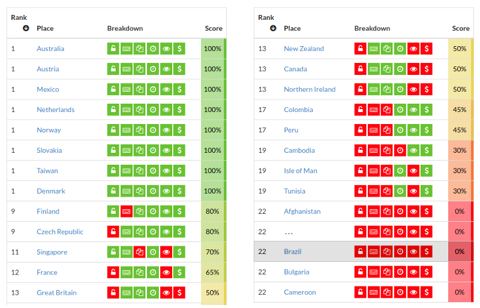

<!-- pode ficar mais curto? -->
**
<big>CLP</big> <small style="font-size:8pt">v0.0.6</small>
**

Proposta de **C**ódigo **L**ocalizador de **P**ortão, CLP:  estudos de viabilidade e consulta pública.

A ideia central do CLP é **oferecer de maneira simples e padronizada, através de um código, a localização geográfica de um portão**. O código será também recomendado como expressão digital do  **endereço da casa** ou local ao qual o portão dá acesso.

<!-- Portaria, portão, porta ou portal: -->Portão em sentido amplo, de portaria, porteira, porta, acesso ou portal: no meio urbano a menor distância entre portões é da ordem de 3 metros, no meio rural (ou ainda nos parques e condomínios do meio urbano) é da ordem de 15 metros.

As tecnologias para se implantar e padronizar um CLP  são bem consolidadas, existem opções como o [Geohash](http://geohash.org/6gyf4bf1n), [S2](https://s2geometry.io/) ou [PlusCode](https://plus.codes/588MC9X8+RC), que são padrões livres, e MapCode <!--(http://www.mapcode.com/getcoords.html?iso3=331&mapcode=RR.56&xx=-46.633956&yy=-23.550385)--> ou Whats3words, patenteados mas úteis como exemplo. Estas opções tecnológicas globais podem ser melhor **adaptadas às condições e padrões locais do Brasil**, e nisto consistirá uma parte relevante dos estudos e recomendações realizados pelo presente projeto.

# Motivações e estratégias

O conceito de *portão* do CLP está relacionado a local onde se habita ou se trabalha, ou onde são prestados serviços públicos: saber do local e informar oficialmente o local **são necessidades básicas asseguradas pela   [Constituição](https://www.senado.leg.br/atividade/const/constituicao-federal.asp)**, tais como *habitar* (arts. 6º e 23), *ir-e-vir* (art. 5º inc. XV), *ser informado* (Art. 5º inc. XXXIII) e *trabalhar* (arts. 6º, 170 e 193).  Se um desses casos carece de **endereço oficial**, é uma dívida em aberto, do governo com o cidadão. A  chave da informação oficial, nos dias de hoje, é localizar a posição em mapa público e aberto (livre de patentes ou direitos autorais), tal como [OpenStreetMap](http://OSM.org). É uma questão de **soberania nacional**, não depender de patentes, direitos autorais ou infraestrutura privada.

Em 2018 a Secretaria da Agricultura de Estado de São Paulo reconheceu essa dívida para com os habitantes e serviços do meio rural,  e procurou a Comunidade OpenStretMap em busca de soluções soberanas abertas. Convidados em seguida prefeituras usuárias do OpenStreetMap e o Terceiro Setor, através de entidades tais como a [TETO BRASIL](https://www.techo.org/brasil/), elas também vêm dialogando com a comunidade técnica em busca de soluções abertas.

Outras aplicações para o CLP não faltam (!). *Localizar* e *descrever onde está localizado* vale para casa, carro, bicicletário, bicicleta, café, chocolate, cachorro, barraca da feira... Uma lista infinita, que parece limitada apenas pela imaginação.

O sistema universal de localização, preciso e reconhecido por qualquer país do mundo, no mapa de papel ou no mapa da internet, é a coordenada geográfica (latitude/longitude).  Mais especificamente coordenadas medidas no [sistema WGS84](https://es.wikipedia.org/wiki/WGS84#Par%C3%A1metros_B%C3%A1sicos_de_Definici%C3%B3n), presente inclusive em mapas eletrônicos e dispositivos de localização (ex. GPS do celular). Todavia essa localização é representada por números que somam de 12 a 14 dígitos, **não é curto** como uma placa de carro ou número de telefone. O Geohash, PlusCode e similares, para a mesma precisão, gastam 6 a 9 caracteres: são soluções viáveis, até mesmo para substituir o CEP.

O CEP `20031-050` do endereço de entrada do Teatro Municipal do Rio,<!-- Rua Evaristo da Veiga, 1; ... O CEP `20031-040` da refere-se a uma praça inteira, a Floriano &dash;  que pode também ser referenciada pelo [PlusCode `3RRF`](https://plus.codes/589R3RRF+) ou Geohash `CM9MX`. --> não nos diz onde está, informa apenas que é a rua&nbsp;Evaristo da Veiga.<!-- ](https://www.openstreetmap.org/way/50485413)--> Um código localizador, como por exemplo  **[PlusCode `3RRF+6F`](https://plus.codes/589R3RRF+6F)**, diz exatamente onde está o  portão!<!-- O **CEP `69010-060`** de uma casa em Manaus não nos diz onde ela está, mas o **[PlusCode `VXCG+3R4`](https://plus.codes/678XVXCG+3R4)** diz exatamente onde está o seu portão!-->  <small>&nbsp; &nbsp; [siga o link do `3RRF+6F` para entender se ainda não conhece]</small> 

O CLP, quando representando um endereço, pode ser recomendado como substituto do CEP nos lugares onde o CEP não chegou, tipicamente nas fazendas, vilas e municípios do meio rural.  O CLP pode  ser também expressão do próprio endereço, onde não existe nome oficial de logradouro, como em novos loteamentos, em conjuntos habitacionais precários e em favelas.

... O que seria ideal fazer, melhorar o CEP ou implantar o PlusCode? Ou tecnologia Geohash?  Ou tecnologia S2? Será que podemos melhorar essas tecnologias para as nossas condições, garantindo a padronização de códigos mais curtos para o Brasil?

Em estudos preliminares já comprovamos que é possível usar tais tecnologias e moldá-las ao Brasil e a cada município para deixar o código ainda mais curto.
A seguir um breve resumo de como tentaremos responder a estas e outras questões, junto com a comunidade, através da construção da proposta do CLP.

## Aprendizados com o CEP

Depois de décadas usando o CEP aprendendos que [ele tem problemas](https://github.com/OSMBrasil/CRP/blob/master/substituir-CEP.md) intríncecos do código, e problemas de operação, do "Sistema CEP" como um todo, por reter patentes e direitos autorais, ser centralizado, etc. Sabemos que precisamos do oposto,  **queremos códigos livres** e descentralizados.

Um dos problemas intrínsecos é a dificuldade de se memorizar, o CEP é tão pouco **mnemônico** (pouco amigável para memorização) quanto um número de telefone. O uso de siglas já padronizadas, que já estão em nossa memória, seria um grande avanço. Podemos melhorar o CEP [substituindo prefixos por siglas](http://www.openstreetmap.com.br/CRP/). O&nbsp;código de um CEP do Amazonas&nbsp;(AM) pode ser `AM150‑088` ao invés de `69150‑088`, de um CEP de Tocantins&nbsp;(TO), `TO500‑360` ao invés de `77500‑360`.

Também aprendemos com o uso do CEP que um código com hierarquia é útil. Se formos substituir o CEP por um novo padrão, o CLP, queremos que ele preserve essa característica de ser um código hierárquico.

A hierarquia garante que dois CEPs, digamos `13165` e `13170`, se possuem prefixos iguais, então são vizinhos, estão dentro de uma mesma região, representada pelo prefixo comum, `131` no exemplo.

O CEP com mais dígitos vai representando com mais detalhe uma região do espaço... Mas são 8 dígitos no CEP completo, e ainda assim não representa o endereço exato do portão. **Com o CLP podemos fazer melhor**, e  justamente por isso, entre outras aplicações, o CLP num futuro distante substituiria  o CEP, para num só código, de 7 ou 8 caracteres, chegarmos no portão.

# Comparações e como seria

Vejamos como seria  o CLP, por exemplo, para localizar o "portão" do [MASP](https://pt.wikipedia.org/wiki/Museu_de_Arte_de_S%C3%A3o_Paulo).

Os códigos de localização existentes, como o Geohash ou o PlusCode, assim como estão, já seriam melhores do que o CEP. Mas eles também podem ser melhorados, **adaptados para o Brasil**, fazendo uso do que os brasieiros já têm no seu dia-a-dia. Deveria ser natural, por exemplo:

* o uso de abreviações consagradas como os **códigos de estado**: `BR-SP` ou simplesmente `SP` designa o Estado de São Paulo, `AM` Amazonas, etc.

* a [abreviação de **3 letras do município**](spec04ap01-siglas.md):  Sampa é `SPA`, a vizinha Guarulhos `GRH` e Piracicaba `PIR`... Jaraguá do Sul em SC é `JGS`.<!-- ver rodovia municipal JGS-489 -->

* das regras de  **hierarquia**: primeiro sigla estadual depois municipal. A sigla  PIR só tem significado dentro da sua hierarquia, `SP-PIR` significa Piracicaba, que é diferente de `GO-PIR`, de Pires do Rio;

* do **contexto**. Numa carta internacional acrescentamos prefixo `BR` ficando `BR-SP-SPA`, mas se a carta  circula apenas dentro de SP basta a sigla do município, como `PIR` ou `SPA`.

Estas regras simples, uma vez formalizadas como padrão, garantiriam um código CLP mais adequado para o brasileiro usar. As siglas, não se vê todos os dias, mas já vinhamos usando: em diversos códigos oficiais, em mapas e nas placas de vias públicas. As siglas estão no *código das estradas* federais (ex. [BR-116](https://pt.wikipedia.org/wiki/BR-116)), estaduais (ex. [SP-147](https://pt.wikipedia.org/wiki/SP-147)) e municipais (ex. PIR-033). <!-- ... mas já vinhamos usando: em diversos códigos oficiais, tais como [identificadores LEX de normas jurídicas](https://pt.wikipedia.org/wiki/Lex_(URN)), e nas placas de vias públicas ou mapas oficiais.-->

Vejamos as siglas e os códigos inteiros no caso da localização no museu do MASP, como é hoje e como seriam pequenas adaptações:

Opção de CLP proposta (contexto BR) | portão do MASP na tecnologia de referência
----------------------|---------------------
**`SP`**     | [**Código ISO** 3166](https://en.wikipedia.org/wiki/ISO_3166-2:BR) do estado (BR-SP)
**`SP:Y`**   | opção [*Geohash*](http://geohash.org/6gy) da região (`6gy`)&nbsp; ~140x140 km
**`SP-SPA`** | [**Código Oficial** do município](spec04ap01-siglas.md#padrao-estadual) (`BR-SP-SPA`)
**`SP:YCF`** | opção [*Geohash*](http://geohash.org/6gycf) da sub-região (`6gycf`)&nbsp; ~4x5 km
**`SP:E59`** | opção [*S2*](https://s2.sidewalklabs.com/regioncoverer/?center=-23.543286%2C-46.649618&zoom=12&cells=94ce59) da sub-região (`94ce59`)&nbsp; ~8x8 km <!-- estado SP = 94c, 94ce59 é macro do MASP -->
(contexto BR-SP) |
**`SPA-YCFQ.F0`** | [*Geohash*](http://geohash.org/6gycfqf0) do **portão** (`6gycfqf0`)&nbsp; ~25x20&nbsp;m
**`SPA-YCFQ.F0M`** | [*Geohash*](http://geohash.org/6gycfqf0m) de um  ponto (`6gycfqf0m`)&nbsp; ~4x4&nbsp;m
**`SPA-C8QV+CJ`** | [*PlusCode*](https://plus.codes/588MC8QV+CJ) do **portão** (`588MC8QV+CJ`)&nbsp; ~15x15 m
**`SPA-C8QV+CJ4`** | [*PlusCode*](https://plus.codes/588MC8QV+CJ4) de um ponto (`588MC8QV+CJ4`)&nbsp; ~3x3 m
**`SPA-2PP5.5C`**&nbsp;\* | [*S2*](https://s2.sidewalklabs.com/regioncoverer/?center=-23.561540%2C-46.656141&zoom=20&cells=94ce59c94ac) do **portão** (`94ce59c94ac`)&nbsp;<!--94ce--> ~15x15&nbsp;m
**`SPA-1CSI.IN1`**&nbsp;\* | [*S2*](https://s2.sidewalklabs.com/regioncoverer/?center=-23.561540%2C-46.656141&zoom=20&cells=94ce59c94ae1) de um ponto (`94ce59c94ae1`)&nbsp; ~2x2&nbsp;m
&nbsp;\* <small>convertido p. base32.</small>|

Qual opção de tecnologia adaptada ao CLP seriam melhor?

No debate devemos chamar atenção para o fato de que o PlusCode não satisfaz o requisito da hierarquia nas macroregiões: é fundamental saber, antes de decidir qual tecnologia usar, **quais critérios consensuais adotaremos como [requisitos do CLP](spec04ap03-reqs.md)**. Nem todos os critérios técnicos são evidentes, e nem todos os critérios são técnicos. Daí o projeto estar enfatizando a formação de um coletivo para a discussão e votação das melhores opções, iniciando por representantes das comunidades brasileiras que entendem do assunto, como a [OpenStretMap Brasil](https://wiki.openstreetmap.org/wiki/Pt:Contact), a TETO Brasil e a Wikidata-Brasil.

Entre os padrões que satisfazem todos os requisitos, como o Geohash e o S2, outras  otimizações podem ainda ser realizadas, levando a códigos mais curtos ou mais mnemônicos.  Ao padronizarmos subregiões do município, por exemplo, podemos reduzir em um dígito ambos os casos S2 e Geohash. Se além disso, fazermos uso de estimativas da "mancha urbana futura" como fizeram o CEP e o MapCode, o resultado fica ainda melhor, mas a custo de códigos mais longos nas vilas do meio rural... Tudo isso seria detalhado pelo presente projeto, para que tenhamos **subsídios para uma decisão racional**.

O <!-- [levantamento sistemático](locationCodes.md)-->levantamento sistemático, com seleção de otimizações viáveis e a [comparação](index_CLPcoord.md#comparando-candidatos) dos resultados otimizados é também tema central da presente proposta, um resultado importante de ser apresentado.
<!--
As recomendações não se limitam à sintaxe dos códigos e sua tradução em latitude-longitude.  Hoje a maioria das aplicações é sensível a contexto, por exemplo meu celular sabe que estou no Estado de São Paulo, onde `PIR` significa Piracicaba, sem risco de confusão com Pirai do Sul (`PIR` no Paraná). São também recomendadas regras de decisão para interpretar prefixos internacionais, tais como `BR-SP` para a capital, mais curto que `BR-SP-SPA`.
-->

## Dois padrões, via e coordenada

Afinal CLP, *Código Localizador de Portão*, faz também papel de "endereço da casa dona do portão".  Falta então definir um outro padrão, que seria uma **expressão compacta do  endereço postal tradicional**.  Por exemplo o endereço do MASP,  *"Avenida Paulista 1578, São Paulo"*. Suponhamos que o código oficial da avenida fosse `U131`, então o CLP  resultaria em algo como &nbsp; **`SPA‑U131‑1578`**.  Alternativamente, em um contexto onde não se disponha do código do logradouro, o padrão também deve prever a expressão por extenso, que no exemplo resultaria em **`SPA‑av_paulista‑1578`**.  <!-- "u" de urbano, é o  menor CEP da via, no caso a paulista usa 01310-000, teria o ponto por exempl Quintana do CEP 04965-010 seria 4965.01  -->

Esse tipo de código é importante para a representação interna dos endereços de correspondência em bancos de dados, links da internet, e na comunicação entre bancos de dados (interoperabilidade).  

Existem portanto dois grupos principais de CLPs:

<table border="0"><tr>
<th width="50%">Definição do tipo</th> <th>Aplicações e exemplos</th>
</tr><tr>
<td><b><a href="index_CLPvia">CLP-via</a></b>: Soluções baseadas na <b>proximidade do portão com uma via de acesso</b> a ele, contendo o código da via e a numeração praticada na via.  O CLP-via seria uma escrita simplificada e padronizada do <a href="https://schema.org/PostalAddress" rel="external">endereço postal</a> tradicional, baseado em logradouro e numeração predial.
</td><td>Garantiria links corretos e maior interoperabilidade entre bases de endereços.
</tr><tr>
<td><b><a href="index_CLPcoord">CLP-coordenada</a></b>:  Soluções baseadas na <b>coordenada geográfica do portão</b>.  Um algoritmo seguro, do tipo Geohash ou outro, toma como entrada as coordenadas padrão <a href="https://en.wikipedia.org/wiki/Geo_URI_scheme" rel="external">Geo URI</a>,<!-- RFC 5870 --> e devolve um código compacto, que é adotado como CLP.
</td>
<td>Seria um código dado por tecnologias como as exemplificadas, Geohash, S2, PlusCode, etc. Além  do CLP-coordenada ser proposto como substituto do CEP, seria também proposto como uma opção de expressão de geocódigo ou de coordenadas em protocolos similares ao Geo URI.<!-- seria utilizado também localizador em aplicativos, links e outros dispositivos, -->
</td>
</tr></table>

Tecnicamente um tipo pode ser convertido no outro através de [procedimentos de geocodificação](https://en.wikipedia.org/wiki/Geocoding#Geocoding_process). Como existe um crescente *mercado de geocofificação*, a padronização dos dois tipos de CLP  também ajudaria a regulamentar o setor, garantindo a separação entre pré-processamento do CLP-via e a geocodificação, que resulta num *Geo URI* com certo grau de confiabilidade. Quando ambos são fornecidos, ambos podem ser convertidos em coordenadas geográficas e comparados, aferindo-se também um grau de confiabilidade resultante da comparação dos dois.  Critérios mínimos para a avaliação de custo e confiabilidade na geocodificação de endereços brasileiros, portanto, passariam a ser viáveis.

A rigor ambos os códigos, CLP-via e CLP-coordenada, são expressões simbólicas cabíveis dentro das regras de construção de nomes fixadas pelo [padrão RFC-8141](https://www.rfc-editor.org/info/rfc8141), referente à expressão de URNs (do inglês *Uniform Resource Names*). Diversas URNs já são usadas no Brasil, tais como [código de livro ISBN](http://www.isbn.bn.br), e a [URN LEX](http://projeto.lexml.gov.br/documentacao/Parte-2-LexML-URN.pdf), o código oficial identificador de leis e decretos.

A expressão formal do CLP-coordenada do MASP seria algo como `urn:geocode:br-sp-spa:2pp55c`, e do seu CLP-via algo como `urn:geocode:br-sp-spa:via:av_paulista-1578`, mas isso apareceria apenas em links e bancos de dados.

<a name="sintaxe">Na prática</a> os códigos impressos, para leitura humana, sinalização, correspondência, etc. aparecem em contextos onde a syntaxe completa de  `urn` é dispensável, ficando apenas a estrutura essencial:

Em ambos os casos o significado de "resolver o código" é transformar o código em uma coordenada geográfica, um ponto<!-- ou *célula da grade*--> no mapa representando a localização do portão.  Os algorítmos (softwares) de transformação não podem ser patenteados, precisam ser abertos, livres de direitos autorais, assim como os dados &mdash; disponíveis por exemplo <!-- em [datasets.ok.org.br](http://datasets.ok.org.br/city-codes)  e--> no [OpenStreetMap.org](http://OpenStreetMap.org).

# Planejamento

O trabalho foi apenas esboçado,  um banco de dados está sendo preparado, alguns testes foram feitos, parte da comunidade já está dialogando... Todavia há muito  que ser realizado, completando tarefas, coordenando voluntários, ampliando o debate e sistematizando decisões. Não é muito diferente do ciclo de construção de normas técnicas. <!-- A seguir o planejamento detalhado, incluindo metas e prazos.-->

## Objetivo e metas do trabalho

Resumo:
> Construir, debater e revisar com a comunidade os **requisitos do CLP**, que subsidiarão os testes, seleção e debate das principais alternativas tecnológicas &mdash;  por exemplo Geohash, PlusCode e S2geometry &mdash;, elegendo-se entre elas o fundamento do CLP .  Construir, debater e revisar com a comunidade a **especificação&nbsp;técnica&nbsp;do&nbsp;CLP&nbsp;v1.0**, bem como disponibilizar protótipos para a realização de testes abertos durante a consulta pública.   Alinhar a proposta através do diálogo com autoridades técnicas (ex. ABNT, IBGE e universidades) e governamentais (ex. SINTER e secretarias de estado), oferecendo após consulta pública, uma **proposta&nbsp;CLP&nbsp;v1.1** mais consistente e consensual.

As discussões e  decisões coletivas seguirão a  ["metodologia das rodadas de discussão estruturada"](https://wiki.openstreetmap.org/wiki/WikiProject_Brazil/Associa%C3%A7%C3%A3o/Rodadas), ou similar. Incialmente em um grupo mais especializado depois crescendo para um coletivo mais amplo na análise das soluções:

1. Comunidades OpenStreetMap e Wikidata. Esse núcleo inicial tem ajudado a delimitar o escopo nos requisitos e a listar todas as potenciais soluções.

2. Representantes das demais comunidades do terceiro setor e universidades. Por exemplo ONGs de inclusão social e construção de habitações já vem apoiando a formalação dos requisitos. ONGs orientadas a software e dados abertos ajudam a testar soluções. Todas, através dos testes e do diálogo tomam parte nas rodadas de busca de consenso para as melhores práticas e soluções.

3. Empresas. Ajudam a avaliar a viablidade do "ecossistema de soluções" que poderiam surgir em torno do padrão, e em todas as instâncias do debate técnico.

4. Prefeituras menores. É prevista a realização de testes concretos em municípios menores, com o apoio de prefereituras que já vinham aderindo a soluções abertas e uso do OpenStreetMap.

5. Autoridades governamentais.   Já vem ocorrendo o diálogo por exemplo com o SINTER (Sistema nacional de gestão de informações territoriais), ligado à Receita Federal, e Secretarias do Estado em SP. Apesar de ser importante o diálogo ao longo de todo processo, a formalização se dará apenas no final, com a proposta v1.0 consolidada. Outros importantes atores no setor são o IBGE, a ABNT e as diversas Secretarias de Estado, na Agricultura, na Habitação, no Turismo, e no Meio Ambeinte.

<!--
1. Estabelecer formalmente os **requisitos do CLP**, traduzindo em parâmetros objetivos as decisões discutidas. [[esboço](spec01-hub.md)]

2. Levantamento, com apoio da comunidade, das **principais soluções e padrões vigentes** para os requisitos fixados.
!--
 A cada solução avaliar se ela satisfaz os requisitos e se existem casos de uso em prefeituras ou outros países. Em seguida classificar variantes quando existirem alternativas ou parametrizações.  Soluções sem  licença aberta ou adaptações em conflito com patentes ou *copyright* já seriam  eliminadas nesta etapa.--!

3. Estabelecer formalmente todos os **algoritmos candidatos**, incluindo  **variantes adaptadas** às condições do Brasil (uso de abreviaturas de nomes de cidade por exemplo).

4. Definição, com apoio da Comunidade, de um **conjunto de testes** (*benchmark*) ao qual todas as soluções e suas variantes serão submetidas, estabelecendo critérios de rejeição e parâmetros de comparação.

5. **Relatório dos resultados** de testes principais, alguns eliminatórios.

6. **Oferta pública de protótipos** para a comunidade testar durante um período os padrões e variantes satisfatórios.  

7. **Redação** e revisão da especificação técnica do CLP, seguida de disponibilização para **consulta pública** e debate, principalmente terceiro setor,  universidades, etc.

8. **Texto final da especificação técnica do CLP**, redação, e entrega de pareceres.

9. **Adoção e apoio a projetos-piloto** com encaminhamento e reutilização da infraestrutura de testes viabilizada. Já se encontram em negociação, por exemplo, pequenas prefeituras e entidades como a TETO Brasil.

10. **Diálogo com autoridades locais** e governo em geral. Já vem ocorrendo e **vai ocorrer em paralelo**, ao longo de todo o processo.

    * Municípios: representantes do Executivo e/ou Legislativo.

    * Seretarias de estado: DER, Agricultura, Meio Ambiente, Turismo, etc.

11. **Diálogo com autoridades nacionais**. Com resultados seguros e a legitimação das comunidades e autoridades locais, o dilágo deixa de ser consultivo e passa a ser mais propositivo. É quando podemos apoiar e somar esforços com as autoridades técnicas do assunto, tais como **SINTER**, IBGE, ABNT, etc. Mesmo que não estejam envolvidas diretamente com a questão do endereçamento, o ideial é que façam uso de mesma infraestrutura e fundamentos tecnológicos, reusando cada qual no seu setor. !-- são os órgãos que avaliam e determinam os padrões nacionais desse tipo.--!

12. **Revisão final e publicação da versão 1.1**. Após o diálogo com autoridades, mediado pela versão&nbsp;1.0, pode surgir a demanda por adaptações menores, resultando na consulta pública, revisão e publicação da versão&nbsp;1.1 da proposta do CLP.

Todo o relacionamento com a comunidade seria realizado através da metodogia das ["rodadas de discussão estruturada"](https://wiki.openstreetmap.org/wiki/WikiProject_Brazil/Associa%C3%A7%C3%A3o/Rodadas), ou similar, já bem testado com a Comunidade OSM Brasil, e aberto a outros grupos interessados.
-->
## Não estamos sozinhos

A busca por soluções tecnológicas é mundial, floresceu nos anos recentes. As principais motivações são a ineficiência dos códigos tradicionais e a sua falta de abertura. A lista de [OpenDataIndex referente a *Postcodes*](https://index.okfn.org/dataset/postcodes/), os análogos do CEP, com uma centena de outros países, destaca que apenas ~5% são considerados razoavelmente abertos: 90% dos países ainda apresentam problemas sérios de licença privada e exploração comercial sobre dado público, como no Brasil.

Quanto à tecnologia, na Europa, Japão e outros países já se estuda um "*upgrade*" dos respectivos CEPs. Na Irlanda por exemplo [diversas alternativas tecnológicas foram estudadas entre 2010 e 2011](https://en.wikipedia.org/wiki/Postal_addresses_in_the_Republic_of_Ireland#Alternative_location_codes), resultando mais tarde na implantação de um sistema mais moderno, o Eircode, baseado em coordenadas geográficas.

Quanto à população mais sensível ao problema de "não ter um endereço para chamar de seu", no Brasil, quem mais sofre é a população do **meio rural**, e os bairros e regiões em situação de **habitação precária** &mdash; segundo dados da [TETO Brasil](https://www.techo.org/brasil/) são ~15 milhões habitantes desatendidos pelo CEP ou nome de rua.  Todos beneficiariam enormemente de um código de localização oficial, um CLP para o local onde habitam.

------

&#160;&#160;Este projeto se encontra disponível em [github.com/**OSMBrasil/CLP**](https://github.com/OSMBrasil/CLP) ([discutir aqui](https://github.com/OSMBrasil/CLP/issues)).

&#160;&#160;Conteúdos e dados deste projeto são dedicados ao domínio público. Ver também [Créditos das imagens](assets/README.md#Imagens).    &#160;&#160;
