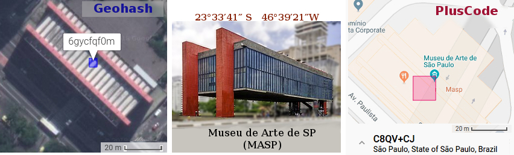
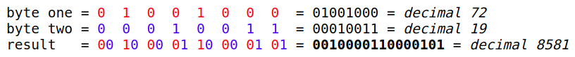

((em construção))

**
<big>Algoritmos ingênuos: soluções válidas</big>
**

O termo *algoritmo* em Computação é sinônimo de "receita" utilizada para fazer algo, como um cálculo. Fica caracterizado por seu nome, suas entradas e suas saídas:

* ENTRADAS: são os "ingredientes" que serão transformados em saídas, ou que estabelecem parâmetros de decisão para modificar a saída. Num algoritmo de CLP as entradas principais são as coordenadas geográficas.

* SAÍDAS: é o resultado final, o "bolo" gerado pela receita &mdash; que num algoritmo de CLP é um código.

* NOME: batizamos com nomes diferentes quando os resultados, entradas ou performance é diferente dos seus similares.  NOME DE VARIANTE: mantemos o "nome de família", por exemplo Geohash36 é uma variante do Geohash que muda o resultado final e acrescenta algumas opções de entrada.

O Geohash e o PlusCode são nomes de algoritmos diferentes, que chegam a resultados diferentes, mas ambos calculados com rapidez e precisão.

Um ***algoritmo ingênuo*** seria aquele que ataca o problema de maneira direta e óbvia,  norteada pela intuição, sem maior preocupação com com a rapidez, ou casos anômalos [ref](https://stackoverflow.com/a/5700793/287948). São importantes como referencial didático, para um primeiro contato do público leigo com o problema. Até pode calhar, mas raramente será considerado um algoritmo sério. Pode ser recomendado por exemplo para o uso em condições extremas, onde não existe acesso a bancos de dados.

A seguir os algoritmos principais envolvidos na abordagem mais direta do CLP-coordenada, que simplesmente toma um par de valores de latitude e longitude padrão (cada coordenadada com 7 a 10 dígitos), e a devolve a mesma coisa em uma representação comprimida, um código só de 6 a 10 dígitos.  Nesta seção serão detalhados na sua "receita ingênua", mas a sua modularização, em algoritmos menores, é válida para outros algoritmos.

Outras fontes de explicação: na [comparação](comparacao.md) foram apresentados os principais "algoritmos sérios", e na [especificação das soluções CLP-coordenada](spec02-coord.md) as suas principais variações.  No [FAQ](FAQ.md) são respondidas perguntas que podem eventualmente ajudar o público leigo a entender o jargão e conceitos técnicos envolvidos.

## Compactação ingênua

Algoritmo de conversão de coordenadas geográficas em CLP-coordenada através da "compactação ingênua".

* ENTRADAS: as coordenadas de um ponto sobre o território nacional, em formato decimal padrão.  Exemplo  da [apresentação](index.md#latitude-longitude-e-contexto-a-solucao), o MASP em São Paulo, nas coordenadas *"-23.56151,-46.65596"*, com precisão de ~5m. A entrada pode ser expressa no padrão Geo URI,  `geo:-23.56151,-46.65596;u=5`, composta rigorosamente por: `latitude` (primeira coordenada, "-23.56151" no exemplo) `longitude` (segunda coordenada, "-46.65596" no exemplo) `uncertainty` (abreviado `u` com valor 5 no exemplo)

* ENTRADA OPCIONAL: o contexto em geral é "Brasil", de modo que na saída, o código resultante pode omitir o prefixo `BR`. <!-- Se o contexto for `BR-SP` pode-se omitir também o `SP` do resultado... Ver regras de contexto da Especificação -->

* SAÍDA: um só código compacto e reversível, que pode ser convertido de volta nas coordenadas da entrada pelo algoritmo inverso.

O passo-a-passo da conversão da entrada em saída é o seguinte:

1. Detecta-se através de um mapa oficial dos municípios, tal como o OpenStreetMap, qual o município da coordenada. O mapa retorna o seu identificador de município IBGE, `id_ibge`, a sua abreviação de 3 letras, `abbrev3` e os valores mínimos de latitude e longitude daquele município, `minlat` e `minlon`.  No caso do exemplo temos  `id_ibge := 3550308`, `abbrev3 := "BR-SP-SPA"`,  `minlat := -24.007` e `minlon := -46.8264088`<!-- Os dados básicos do município são ofertados pela Wikidata ou [datasets.ok.org.br/city-codes](http://datasets.ok.org.br/city-codes).-->

2. Obtém-se as "coordenadas locais" subtraindo cada componente, ou seja,  `latitude_local := latitude - minlat`;  `longitude_local := longitude - minlon`.  No exemplo resultaria em `latitude_local=0.44549` e `longitude_local=0.17045`.

3. Obtên-se um "numerão" a partir da normalização e "fusão" das coordenadas locais.  A forma mais ingênua é concatenar, mas pode-se usar variantes como a "fusão por intercalação". A normalização consiste apenas em acrescentar zeros a esqueda da parte inteira ou à direita da parte fracionária, quando necessário.  No exemplo: ... `numerao = normaliza(latitude_local,u) || normaliza(longitude_local,u)`.

5. Converte-se o numerão decimal para base32. Variantes podem considerar base36 ou base58, assim como diferentes alfabetos.

6. O código por fim é obtido

### Exemplo novamente

Apenas apresentando em narrativa mais longa o que já foi indicado acima no passo-a-passo, e que o algoritmo ingênuo não fica muito atrás dos sofisticados Geohash e PlusCode.

Tecnologia de referência (código padrão) e resolução | Opção de CLP proposta
----------------------------------|---------------------
***Ingênuo*** (`44OH8TL`)&nbsp; ~4x4 m | **`SPA-44OH.8TL`**
[*Geohash*](http://geohash.org/6gycfqf0m) (`6gycfqf0m`)&nbsp; ~4x4 m | **`SPA-YCFQ.F0M`**
[*Geohash*](http://geohash.org/6gycfqf0) (`6gycfqf0`)&nbsp; ~25x20 m | **`SPA-YCFQ.F0`**
[*PlusCode*](https://plus.codes/588MC8QV+CJ) (`588MC8QV+CJ`)&nbsp; ~15x15 m | **`SPA-C8QV+CJ`**

O CLP do MASP poderia ser formado só pelos dígitos das coordenadas, algo como `2356151,4665596`, mas ainda seriam 7+7=14 dígitos, muito longo para lembrar ou digitar.  As coordenadas podem ficar mais compactas se ao invés de serem representadas na base10 (decimal), usarmos a [base32](https://en.wikipedia.org/wiki/Base32), o que resultaria em `27STN,4EC7S`, 5+5 dígitos. Ainda melhor sem a vírgula, tudo num só numerão, pois a conversão trata ele como um todo e fica um dígito mais compacto, `LDNBRCHJS`... pronto, 9 dígitos!

Compactamos a informação original de 14 dígitos para 9, simplesmente estabelecendo uma convenção de representação mais adequada para um código... Podemos fazer melhor?  Sim, ainda sem recorrer a receitas numéricas complexas, podemos **usar a informação de contexto**. O contexto do MASP **é o município** de São Paulo, que podemos abreviar para `SP` já que é a capital do Estado &mdash; se fosse digigamos Piracicaba seria uma abreviação de 3 letras, `PIR`.

Se levar  em conta as coordenadas de todos os pontos internos ao traçado do município de São Paulo tem o mesmo prefixo, como latitude na forma "-23.5<i>etc</i>" e longitude "-46.6<i>etc</i>", podemos incluir o sigla `SP` do município no código e elinar dígitos redundantes do seu contexto. No caso do Geohash fazemos [cortando a parte inicial do código]() que for comum a todos os pontos da cidade.

Matematicamente, há uma forma mais precisa do que cortar prefixos. Fazemos isso subtraindo a menor latitude (-24.007) e a menor longitude (-46.82641) o que resultaria em coordenadas 0.44549 e 0.17045 para o MASP, concatendo-as num numerão e depois representando em base32 resultaria em `44OH8TL`, ou seja, o código mais curto e palatável para o ser humano, `SP-44OH.8TL`. Que mágica, temos uma receita simples e um código compacto!

O código `SPA-44OH.8TL` é bem **mais fácil de lembrar** do que as coordenadas, porque a sigla do município é amigável, e o restante dos caracteres é mais curto do que um número de telefone. Claro, esse *não é o padrão proposto* pois ele carece de outras características que o Geohash e outros padrões oferecem. <!-- &mdash; e por isso estamos empreendendo um grande estudo.--> O que precisa ficar claro é que a tecnologia pode ser simples, a mágica está em estabelecer um consenso no que queremos, não em encontrar uma receita complexa para resolver o problema.

## Fusão intrelaçada ingênua

A fusão de latitude com longitude "num só numerão" (realizada conforme acima [para fins de compactação](#compactacao-ingenua)), a rigor precisa ser feita bit-a-bit conforme descrita [nesta dica de algoritmo em linguagem C](https://stackoverflow.com/a/47369248/287948). A seguir o algoritmo ingênuo tem a finalidade exclusiva de ser didático, mostrando como essa vontade de "fundir números num só", de forma um pouco mais inteligente, acabou levando aos algoritmos modernos de indexação baseados em curvas fractais.

No algoritmo mais ingênuo, descrito acima, a fusão é realizada por simples concatenação. Essa técnica é satisfatória em termos de compactação, mas apresenta inconvenientes no código resultante, porque leva a células vizinhas com prefixos diferentes. A estratégia de simplesmente intercalar os dígitos já figura como solução na representação decimal. Tomemos novamente o exemplo do MASP, com coordenadas locais `lat:=44549; lon:=17045;` intercalar é ir concatenando dígito a dígito, revezando entre as coordendas. Passo-a-passo:

1. primeiro dígito de `lat` é `4`. Sobram `lat=4549` e fica `fundido=4`;
2. primeiro dígito de `lon` é `1`. Sobram `lon=7045` e fica `fundido=41`;
3. segundo dígito de `lat` é `4`. Sobram `lat=549` e fica `fundido=414`;
4. segundo dígito de `lon` é `7`. Sobram `lon=045` e fica `fundido=4147`;
5. ... `fundido=4147504495`.

Agora esse numerão fundido tem o mesmo comportamento por exemplo que o CEP: dois endereços sem primeiros dígitos iguais estarão a muitos quilômetros de distância, talvez extremos diferentes do país; com primeiros digamos 4 dígitos iguais estão numa mesma macro-região... E se diferem apenas nos dois últimos dígitos, são endereços vizinhos.

Repare que é tão compacto quanto a concatenação direta, o fundido decimal tem 10 dígitos e o base32 (`3RJBPBF`) 7 dígitos, como no caso concatenado. Sendo assim **não há razão alguma para concatenar, é sempre melhor fundir**.

Mas nem sempre dá sorte de todos os endereços de uma cidade, quando representados dessa forma,  terem um mesmo prefixozão, será um prefixozinho e isso não ajuda muito a compactar pelo "prefixo municipal".  Para se obter um prefixo municipal maior é preciso usar uma base numérica menor, ou seja, menor que a base10 no exemplo. E a menor base possível é a base2, por isso o algoritmo correto, mais eficiente é a intercalação em base2.

Esse pequeno milagre de preservar prefixo nas vizinhanças foi descoberto por acaso ao organizarmos melhor a concatenação, e tem uma explicação geométrica, pois o entrelaçamento resulta numa ["curva de ordem Z"](https://en.wikipedia.org/wiki/Z-order_curve)... E justamente essa curva explica os problemas residuais de "saltos de vizinhança", que nem o algoritmo binário resolve.  Na verdade o algoritmo Geohash acrescentou uma pequena melhora, trocando as coordenadas usuais pela divisão binária recorrente do globo terrestre, mas ainda assim não resolve os saltos da curva Z.  Só a curva de Hilbert parece dar uma solução mais satisfatória. Ela é usada em algoritmos exóticos, como o [Geohash-hilbert](https://github.com/tammoippen/geohash-hilbert), e em algoritmos padronizados modernos, como o [S2-geometry](https://s2geometry.io/).

## Indexação ingênua da grade municipal

Para qualquer algoritmo de conversão das coordenadas num só código, consta-se que o código será mais compacto quanto menor for a área do município. Isso alias é um dos fundamentos, já enunciados pelo MapCode ... ((link equação área em função do número de dígitos))

Assim, uma área municipal muito densa ou muito grande precisa ser subdividida em áreas menores, para garantir resultados mais compactos... Mas ao subdividir haverá o custo adicional de se indicar o código dessa área menor. Nisso consiste a indexação.

* ENTRADAS: geometria do polígono do município (`geom`) e parâmetros de cobertura, principalmente a quantidade-alvo de células na grade (`target` indicando 32 ou 1024).

* SAÍDA: lista de identificadores de célula, tipicamente células S2. `cells`.

Passo-a-passo, depois de padronizar a base do código resultante (nos exemplos usamos base32),

1. Avaliar se a área do município (`geom`) requer zero, 1 ou 2 dígitos de indexação.  No caso do exemplo "dígitos base32", de modo que seriam partições da área em zero (fica como está), 32 partes ou 1024 partes.  No caso de São Paulo, parece razoável um só dígito, ou seja, o resultado seria `target=32`.

2. Usar um algoritmo de partição qualquer (*S2* por exemplo), sem compromisso com o sistema de representação. Equivale a aplicar uma "grade de nível L" à área do município, onde L é o nível hierarquico da grade. Ajusta-se o melhor possível para particionar o máximo com o número de dígitos indicado pelo passo anterior.

3.  Listar os identificadores de grade ou seu intervalo, como resultado em `cells`. A ordem dos elementos em `cells` já é o índice da célula (ex. valores de 0 a `target-1`) para aquele município.

