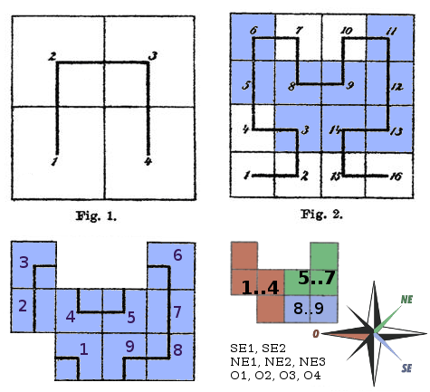

((em construção))

**
<big>Segunda camada: propostas ingênuas</big>
**

Continuação do apêndice  ["Algoritmos ingênuos"](spec04ap05-ingenuos.md), porém com **enfoque numa segunda camada de protocolos ou aplicações**. Ou seja, uma vez instituido um padrão de CLP, seja ele CLP-via ou CLP-coordenada, podem ser acrescentados outros padrões para ampliar o leque de aplicações, e sem interferir na "camada abaixo".

## Protolos alternativos

Enquanto o foco do CLP é o conceito de portão, ou seja, a localização de um ponto geográfico em escala de transporte, outros protocolos podem cobrir outras necessidades, fazendo o uso do CLP como infraestrutura. Se tomarmos como referência da "infraestrutura de um padrão CLP" o prefixo de código, teríamos as seguintes "camadas acima" típicas:

* padrão SINTER para identificação de lotes: fazendo uso do mesmo prefixo que o CLP, garante maior resiliência e aderência para ambos, o próprio SINTER e o CLP.

* padrão para a localização de cruzamentos: ...

* padrão para a localização de quadras ou endereços dentro de quadras: ...

Além disso, por pressão de novas propostas como o padrão [what3words](https://what3words.com/), é necessário ao menos sugerir como seriam padronizados **sinônimos dos códigos de CLP** expressos em um padrão de segunda camada. A contra-partida dos geocódigos não-mnemônicos (ao what3words que é totalmente mnemônico) tem sido a sugestão de nomes alternativos a prefixos de código (sinônimos de prefixos), baseados em palavras derivadas de nomes mais afinados com nomes consagrados de áreas, bairros ou marcos geográficos. Alguns algoritmos ingênuos serão apresentados como prova de conceito de tais sugestões.

## Uso de palavras em protocos alternativos

A rotulação tem sido sugerida por pressão do destaque que tomou o padrão [what3words](https://what3words.com/). A contra-partida dos geocódigos não-mnemônicos tem sido a sugestão de nomes alternativos a prefixos de código (sinônimos de prefixos), baseados em palavras derivadas de nomes mais afinados com nomes consagrados de áreas, bairros ou marcos geográficos.

### Redução de nomes a palavras

Hoje no Brasil já se praticam em algumas cidades como São Paulo o uso de "rotulação abreviada por palavra distintiva", tipicamente quando de nomes compostos, em nomes de rua.

Essa estratégia é válida em contextos onde o conjunto de nomes é *reduzido*. As placas azuis de Sâo Paulo funcionam bem porque ao longo de uma via principal, o número de vias perpendiculares é limitado, e para fins de seleção de palavras não-repetidas pode-se considerar um  *conjunto reduzido*.

* ENTRADAS: conjunto de nomes completos.

* SAÍDA: conjunto de pares `(nome_completo,palavra)`.

Trata-se de um algoritmo estatístico, que toma como entrada nomes completos e devolve palavras.

Policia, ambulância, bombeiro e outros serviços que precisam transmitir por rádio e sem ambiguidade o nome da localização, que por vezes é um cruzamento ou uma quadra idenfinida. Ao invés de soletrarem "B de bola, T de tatu, ... " (ou como radioamador "bravo tango ...") também poderiam fazer uso de algo mais econômico (menos letras) e mais semântico (correlação com nomes das áreas).

Do ponto de vista estatístico é possível evitar ambiguidades e nomes de rua repetidos de uma cidade restringindo-se o conjunto de nomes de rua a uma região, uma sub-divisão da cidade do tipo norte/sul/leste pode ser suficiente. Por exemplo em São Paulo (SPA), seria válido o `geocodigo:cruzamento` (ponto de cruzamento) com nomes conhecidos `SPA-centro-brigadeiro-paulista`.

O mesmo princípio vale para nomes de bairro em uma cidade.  Em Jaraguá do Sul, por exemplo, são quase 40 bairros e sua zona rural. O número é limitado e é possível fazer uma seleção razoável de palavras não-repetidas.

palavra   | Nome do bairro            | palavra  |  Nome do bairro            
----------|------------------------------|----------|------------------------------
`agua`         | Água Verde         | `joao`        | João Pessoa
`amizade`     | Amizade            | `lalau`       | Vila Lalau
`antonio`     | Santo Antônio      | `lenzi`       | Vila Lenzi
`baependi`    | Vila Baependi      | `luz`         | Rio da Luz
`cerro`      | Barra do Rio Cerro  | `luzia`       | Santa Luzia
`bmolha`      | Barra do Rio Molha | `malwee`      | Parque Malwee
`boa`         | Boa Vista          | `molha`       | Rio Molha
`braco`       | Braço do Ribeirão Cavalo| `monos`       | Tifa Monos
`brasilia`    | Nova Brasília      | `nereu`       | Nereu Ramos
`cavalo`      | Ribeirão Cavalo    | `nova`        | Vila Nova
`centenario`  | Centenário         | `noventa`     | Jaraguá 99
`centro`      | Centro             | `oitenta`     | Jaraguá 84
`riocerro`       | Rio Cerro I     | `rau`         | Rau
`cerrodois`   | Rio Cerro II       | `rural`       | Área Rural de Jaraguá do Sul
`chico`       | Chico de Paulo     | `sluiz`       | São Luís
`claras`      | Águas Claras       | `tifa`        | Tifa Martins
`czerniewicz` | Czerniewicz        | `tresnorte`        | Três Rios do Norte
`esquerdo`    | Jaraguá Esquerdo   | `tressul`    | Três Rios do Sul
`estrada`     | Estrada Nova       | `vieira`      | Vieira
`ilha`        | Ilha da Figueira   | |

Conforme veremos a estratégia de criar palavras pode ser substituida por composições norte/sul/leste/oeste dadas automaticamente pelo algoritmo a seguir.

### Rotulação de índices contíguos

(ver também algoritmo de [Indexação ingênua da grade municipal](spec04ap05-ingenuos/#indexacao-ingenua-da-grade-municipal))

A rotulação tem sido sugerida por pressão do destaque que tomou o padrão [what3words](https://what3words.com/). A contra-partida dos geocódigos não-mnemônicos tem sido a sugestão de nomes alternativos a prefixos de código (sinônimos de prefixos), baseados em palavras derivadas de nomes mais afinados com nomes consagrados de áreas, bairros ou marcos geográficos.

No caso de partição usando S2, que identifica cada célula por uma curva de Hilbert, a ordenação pelo índice em geral permitirá  ilustrar a sequência por intervalos associados a  áreas contíguas:

Áreas de células S2 típicas, ilustradas abaixo, são obtias por algoritmos de ajuste parâmetros e otimização, em  algoritmos mais sofisticados.

Algumas referências (ex. [ref06](spec05-referencias.md#ref06)) sugerem associar áreas contíguas a subregiões que já apresentem nomes tradicionais, tais como nomes de bairro ou direções (leste/sul/etc.), criando opções de códigos mais mnemônicos no caso de indexação de dois dígitos.

Sugere-se que o uso de nomes seja sempre alternativo ao uso de códigos, nunca a única opção. Desse modo teríamos substituídos um ou dois dígitos por rótulos, por exemplo (um portão de Piracicaba SP) ao invés de `PIR-1234.456` o código seria `PIR-sul-234.456` ou `PIR-madalena-34.456`. A rotulação de regiões centro/norte/sul/etc em geral é a mais factivel, todavia causaria confunsão com a delimitação oficial e não chega a substituir um dígito por completo. A rotulação com palavras já seria bem mais artificial, não garante associação com nomes de regiões, apenas uma referência vaga (ex. palavra de nome de uma rua que nasce na célula ou de um parque do seu interior).

Uma opção mnemônica mais viável seria acrescentando um dígito decimal arbitrário ao nome da região, resultando em códigos como `PIR-sul2-34.456` ou `PIR-madalena3-4.456`, tendo em vista que a combinação nome-dígito pode ser suficiente para designar cada célula da subregião.

No exemplo de bairros de Jaraguá do Sul, que é uma cidade menor cujas macro-células possuem da ordem de 1km, é possível estabelecer as "domínios de bairro" e neles, quando for mais de um, diferenciar pela direção. Bairros maiores como Cerro, Centro, Ilha e Amizade, teriam suas células rotuladas na forma `cerro_sul`, `cerro_norte`, `centro_leste`, `ilha_oeste`, `amizade_norte`.
<!-- select name_bairro, count(*) n  from  cepaberto.vias where id_city=4700  GROUP BY 1 order by 2 desc,1; -->

<!--
# Algoritmos de geocodificação
(vai pra Metodolodia e proposta de padr~oes )

1. Pré processamemto do endereço tradicional, que pode ser estatístico e gerar nais de um resultado.
2.
com um  CLP-via padronizado pode-se submeter uma lista de endereços pré-processados,
-->
