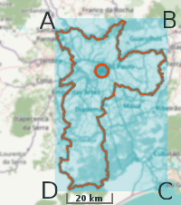

## Auxílio técnico
Descrição auxiliar para descrever ferramentas empregadas nos testes ou conceitos técnicos adotadas numa implementação.


## APÊNDICE - Representações de BBOX
Exemplificando o obtenção e cuidados com a BBOX ([caixa mínima](https://en.wikipedia.org/wiki/Minimum_bounding_box)) de um município. [São Paulo](https://www.openstreetmap.org/relation/298285) está contido em um retângulo de ~50km por ~70km,



O retângulo *R*, que corresponde à BBOX,  é um conjunto de pontos, *R*={*A, B, C, D*}, e cada um desses pontos possui, grosseiramente, as seguintes coordenadas de latitude e longitude:<br/> &nbsp; `A = -23.357 -46.8264`; `B = -23.357 -46.3651`; `C= -24.007 -46.3651`, `D = -24.007 -46.8264`. <br/>A face superior *AB* do retângulo está mais ao norte, a face inferior *CD* mais ao sul, a face direita *BC* a leste, a face esquerda *AD* a oeste. Na representação em graus, as coordenadas do ponto *A*, por exemplo, seriam `23° 33′S, 46° 38′ W`.

Quando no PostGIS solicitamos a BBOX  através da função ST_Envelope, `SELECT st_astext(st_envelope(geom))`, que retorna o formato "longitude latitude" e numa sequência diferente: `P1 = -46.8264 -24.007`; `P2 = -46.8264 -23.357`; `P3 = -46.3651 -23.357`; `P4 = -46.3651 -24.007`. A ordem ABCD ilustrada na figura corresponderia a `P2=A`; `P3=B`, `P4=C`; `P1=D`.

Quando expressamos os "bounds" é como se listássemos valores sem repetir, visto que podemos deduzir o retângulo *R* a partir de apenas 4 valores. A informação pode ser extraída das diagonais, dois pontos *A* e *C* por exemplo &mdash; latitude máxima em *A* e mínima em&nbsp;*C*, e longitude máxima em _C_ e mínima em&nbsp;_A_. Na função [`bbox_bounds()`](https://github.com/datasets-br/city-codes/blob/master/src/test_illustrating.sql) foi expresso em formato JSON:
```json
"bounds": {
  "minlat": -24.007,
  "minlon": -46.8264,
  "maxlat": -23.357,
  "maxlon": -46.3651
}
```

Esta notação também é utilizada no [Overpass](http://overpass-turbo.eu/), em saídas `[out:json]; ... out bb;`.
