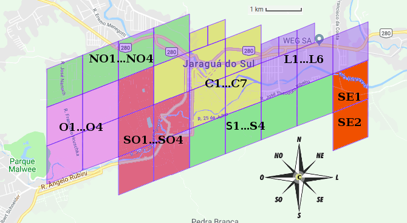

# CLP - Testes e amostras de controle

## Jaraguua do Sul
32 Células de ~1km2 cada:

94de9454,94de945c,94de9464,94de947c,94de9484,94de948c,94de9494,94de949c,94de94c4,94de94dc,94de94e4,94de94ec,94de94f4,94de94fc,94de9504,94de950c,94de9514,94de951c,94de9524,94de953c,94de9544,94de955c,94de9564,94de956c,94de9571,94de9573,94de957b,94de95a9,94de95ab,94debfdc,94debfe4,94debffc

Células de jaraguá, tadas com prefixo 94de: 9454, 945c, 9464, 947c, 9484, 948c, 9494, 949c, 94c4, 94dc, 94e4, 94ec, 94f4, 94fc, 9504, 950c, 9514, 951c, 9524, 953c, 9544, 955c, 9564, 956c, 9571, 9573, 957b, 95a9, 95ab, bfdc, bfe4, bffc

Dentro de | Células   |Nota
----------|-----------|-----
94de949c (**O4**) |94de949b2c7c,94de949b2b9c,94de949b2c5b<br/>6B3S,6ASS,6B2R|Vizinhos, um deles (b2b9c) na Francisco Hruschka, 897.
idem |  94de9484cdb | Rua Albano Piccoli, 53 (CEP 89253-710)
94de947c (**NO4**) | 94de947ee524 |  Escola R. Elpídio Rodrigues, 99 (CEP 89253-774)
idem  |94de947f1a54 |Ponto de bus na Rua Oscar Riegel, 267
idem | 94de947e8e07, 94de947e8e19 | Portas de lotes viznhos na rua Oscar Riegel, células de 2m

JRS-H6B.3S ou JRS-oeste4-6B.3S



[link](https://s2.sidewalklabs.com/regioncoverer/?center=-26.491285%2C-49.085603&zoom=13&cells=94de9454%2C94de945c%2C94de9464%2C94de947c%2C94de9484%2C94de948c%2C94de9494%2C94de949c%2C94de94c4%2C94de94dc%2C94de94e4%2C94de94ec%2C94de94f4%2C94de94fc%2C94de9504%2C94de950c%2C94de9514%2C94de951c%2C94de9524%2C94de953c%2C94de9544%2C94de955c%2C94de9564%2C94de956c%2C94de9571%2C94de9573%2C94de957b%2C94de95a9%2C94de95ab%2C94debfdc%2C94debfe4%2C94debffc)

Dentro de | Células   |Nota
----------|-----------|-----
94de949c  |94de9484cdb, 94de949b2c7c,94de949b2b9c,94de949b2c5b|xx
94de947c | 94de947ee524, 94de947f1a54, 94de947e8e07, 94de947e8e19 | xx

## Dados utilizados na implementação
A resolução final dos prefixos foi feita com auxílio  de [banco de dados PostgreSQL](https://pt.wikipedia.org/wiki/PostgreSQL). A sintaxe dos prefixos e sufixos é a [fixada pela especificação](spec01-hub.md).

### Resolução de prefixo
A tradução das siglas em outros identificadores &mdash; por exemplo da sigla de UF em código numérico IBGE, em nome completo, ou em identificador Wikidada &mdash;, é realizada por datasets já consolidados:   

* Dataset para a resolução de `<uf>`: [datasets.ok.org.br/state-codes//br-state-codes.csv](http://datasets.ok.org.br/state-codes/blob/master/data/br-state-codes.csv).

* Dataset para a resolução de `<abbrev3>`: dados parciais pois ainda não existe uma lista oficial. Há um indicativo, protagonizado pela Secretaria da Agricultura do Estado de São Paulo, para se adotar as siglas já fixadas pelo DER de cada Estado. No dataset  [datasets.ok.org.br/city-codes//br-city-codes.csv](http://datasets.ok.org.br/city-codes/blob/master/data/br-city-codes.csv) adotou-se a suposta padronização de SP, e as demais, incompletas e obtidas da tabela Anatel.


```sql
CREATE TABLE clp.prefix (
  id serial,  --
  kx_path text NOT NULL PRIMARY KEY, -- Cache,  por ex. em Piracicaba/SP é 'SP/PIR'
  prefix text NOT NULL, -- por ex. em Piracicaba/SP é 'PIR'
  uf text NOT NULL, -- por ex. em  Piracicaba/SP é 'SP'
  val bigint NOT NULL,  -- valor da célula a ser usado como prefixo concreto do código.
  UNIQUE(prefix,uf)
  -- {""}
  -- info JSONb com dados da tabela clp.base_cell
);
```

### Resolução dos primeiros dígitos do sufixo
Todas as soluções testadas permitem expressar códigos de forma hierárquia e adotar uma representação numérica de 64bits para o identificador. Assim cada município ficou definido por um pequeno conjunto de células de dois tipos:

* células finais: podem ser utilizadas diretamente transformações de ponto em endereço. A mancha urbana do município sempre estará contida numa grade de células desse tipo.

* células da grade principal: precisam subtrair as células finais nas transformações de ponto em endereço.

```sql
CREATE TABLE clp.kx_base_cell (
  id_prefix int NOT NULL REFERENCES clp.prefix(id), -- join
  index small int NOT NULL primary key, -- indice dado pelo primeiro digito (0-31) ou 2 primeiros (0-1023)
  cell_type tipo_grade, -- base32 do geohash, base32 do S2-Brasil, base20 do PLusCode, etc.
  is_cell_final boolean DEFAULT false,
  val_bin bigint NOT NULL,  -- valor binário célula a ser usado como prefixo concreto do código.
  val_text bigint NOT NULL,  -- valor txt, string de publicação na base esperada.
  UNIQUE(cell_type,val_bin),
  UNIQUE(cell_type,val_text)
);
['aa','ab','xyz']
```

Exemplos: ...

------

&#160;&#160;Conteúdos e dados deste projeto são dedicados ao domínio público. Ver também [Créditos das imagens](assets/README.md#Imagens).   <br/>&#160;&#160;[ ](assets/README.md)
